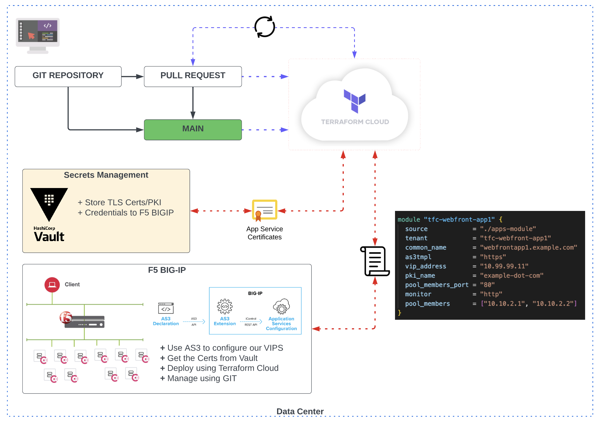

# F5 BIG-IP AS3 VIP Module 
The following repo/code is used to manage my F5 BIGIP configuration using Infrastructure As code.

* Use HashiCorp Vault as my PKI Engine to generate certs
* Use Terraform with F5-DO to Deploy the base/network configurations
* Use Terraform with F5 AS3 with our custom module to allow me to deploy apps
* Use Terraform Cloud to manage the state of the F5 BIG-IP
* Use Github as our Source Code Repository.

## How to deploy new f5 VIP configurations

Article https://medium.com/@maniakacademy/using-hashicorp-vault-to-automate-certificate-lifecycle-management-f5-big-ip-1694cf91e928